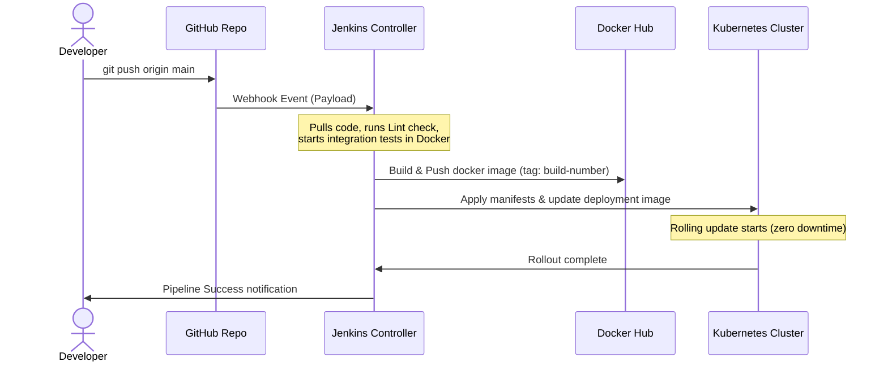

# MediBook — Jenkins CI/CD & Kubernetes Webhook Guide

This comprehensive guide walks you through connecting your **GitHub Repository Webhook** to a **Jenkins CI/CD Pipeline**, packaging your application using **Docker**, and deploying it seamlessly to **Kubernetes** with automated scaling, persistent volumes, and health checks.

---

## 1. System Architecture Overview

When a developer pushes code to GitHub, the following automated pipeline triggers:



---

## 2. Dockerizing the Application

MediBook uses a robust multi-extension **PHP 8.2 + Apache** container designed for production-level traffic.

### 2.1 The Dockerfile (`docker/php/Dockerfile`)
The Dockerfile is structured to cache layer dependencies and execute in the foreground:
- **Base image**: `php:8.2-apache`
- **Extensions**: `pdo`, `pdo_mysql`, `mysqli`, and `gd` (packaged with freetype & jpeg libraries).
- **Security Headers**: Standard headers like `nosniff`, `SAMEORIGIN`, and `X-XSS-Protection` are enabled directly in Apache configuration.
- **Health Checks**: A built-in container-level health probe is defined using `curl`:
  ```dockerfile
  HEALTHCHECK --interval=30s --timeout=5s --retries=3 CMD curl -f http://localhost/ || exit 1
  ```

### 2.2 Local Container Orchestration (`docker-compose.yml`)
To build and test the environment locally before deploying to Kubernetes:
```bash
# Build and run all services (App, DB, phpMyAdmin)
docker compose up -d --build

# View container status
docker compose ps

# Shutdown and wipe transient volumes
docker compose down -v
```

---

## 3. Kubernetes Pods & Deployments

The application is deployed using fine-grained, decoupled Kubernetes manifests located under the `k8s/` directory.

### 3.1 Resource Architecture

| Resource Type | Kubernetes manifest | Purpose | Details |
|---|---|---|---|
| **Namespace** | `k8s/namespace.yml` | Resource Isolation | Standard namespace: `medibook` |
| **ConfigMap** | `k8s/configmap.yml` | Application Configuration | Hosts non-sensitive vars (DB host, port, etc.) |
| **Secret** | `k8s/secrets.yml` | Sensitive Information | Base64 encoded DB credentials |
| **PersistentVolumeClaim** | `k8s/mysql/pvc.yml` | Database Persistence | Requests 5Gi persistent disk storage |
| **Deployment (DB)** | `k8s/mysql/deployment.yml` | Database Pod (MySQL 8.0) | Standard DB engine, uses credentials from Secret |
| **Service (DB)** | `k8s/mysql/service.yml` | Internal Database routing | ClusterIP service routing queries inside cluster |
| **Deployment (App)** | `k8s/app/deployment.yml` | Web Server Pods (PHP) | 2 replicas, configured with rolling update strategies |
| **Service (App)** | `k8s/app/service.yml` | Internal App routing | ClusterIP service exposing the PHP pods |
| **Autoscaler (HPA)** | `k8s/app/hpa.yml` | Horizontal Pod Autoscaler | Scales web pods (min: 2, max: 5) based on 70% CPU usage |
| **ConfigMap (Nginx)** | `k8s/nginx/configmap.yml` | Nginx Proxy Configuration | Custom routing, caching static assets, and SSL settings |
| **Deployment (Nginx)** | `k8s/nginx/deployment.yml` | Reverse Proxy Server Pod | Receives incoming HTTP/HTTPS traffic |
| **Service (Nginx)** | `k8s/nginx/service.yml` | Public ingress | LoadBalancer service providing a single IP/DNS |

---

## 4. Connecting GitHub Webhook to Jenkins

A webhook sends an HTTP POST payload to Jenkins immediately on code commits. Here is how to configure it from scratch:

### 4.1 Step 1: Expose local Jenkins (If running locally)
If Jenkins is running on your Mac (`localhost:8080`), GitHub cannot reach it. You must temporarily expose it via a tunnel:
1. Download and install [ngrok](https://ngrok.com/).
2. Run ngrok to expose your port `8080`:
   ```bash
   ngrok http 8080
   ```
3. Copy the secure **Forwarding URL** provided (e.g., `https://abcd-123-efg.ngrok-free.app`).

### 4.2 Step 2: Configure Webhook in GitHub Repository
1. Navigate to your repository page on GitHub.
2. Go to **Settings** (top tab) → **Webhooks** (left menu) → **Add webhook**.
3. Fill in the parameters:
   - **Payload URL**: `<YOUR_JENKINS_URL>/github-webhook/`
     *(Example: `https://abcd-123-efg.ngrok-free.app/github-webhook/`)*
     > [!IMPORTANT]
     > Ensure you include the trailing slash (`/`) at the end of `/github-webhook/`, otherwise Jenkins will reject it.
   - **Content type**: `application/json`
   - **Secret**: *(Leave blank, or input secret if using Generic Webhook token authentication)*
   - **Which events...**: Select **Just the push event**.
4. Click **Add webhook**. You should see a green checkmark next to your webhook, confirming a successful hand-shake ping from GitHub.

### 4.3 Step 3: Install Jenkins Plugins
Log in to your Jenkins Controller and check if the necessary plugins are active:
1. Go to **Manage Jenkins** → **Plugins** → **Available Plugins**.
2. Search and install:
   - **GitHub Integration Plugin** (Enables Webhook listener triggers)
   - **Docker Pipeline** (Allows Jenkinsfile to build and push images via `docker` keyword)
   - **Kubernetes CLI** (Injects `kubectl` configuration in pipelines)

### 4.4 Step 4: Configure Jenkins Pipeline Job
1. From the Jenkins Home Screen, click **New Item**.
2. Enter Name: `medibook-pipeline`, choose **Pipeline**, and click **OK**.
3. Under **Build Triggers**, check the box:
   - **GitHub hook trigger for GITScm polling** (This connects the webhook triggers to this job)
4. Under **Pipeline**:
   - **Definition**: Pipeline script from SCM
   - **SCM**: Git
   - **Repository URL**: `https://github.com/Manikanta-2006/Medibook.git` (or your personal repository URL)
   - **Branches to build**: `*/main`
   - **Script Path**: `jenkins/Jenkinsfile`
5. Click **Save**.

---

## 5. Configuring Jenkins Credentials

Your pipeline uses credentials to push to Docker Hub and authenticate against Kubernetes:

1. In Jenkins, go to **Manage Jenkins** → **Credentials** → **System** → **Global credentials (unrestricted)**.
2. Click **Add Credentials**:
   
   #### Docker Hub Login:
   - **Kind**: Username with password
   - **Scope**: Global
   - **Username**: `<your-dockerhub-username>`
   - **Password**: `<your-dockerhub-token-or-password>`
   - **ID**: `docker-hub-credentials` *(Must exactly match ID in Jenkinsfile)*

   #### Kubernetes access:
   - **Kind**: Secret file
   - **Scope**: Global
   - **File**: Upload your Kubernetes config file (typically found at `~/.kube/config` on your EKS controller or local machine)
   - **ID**: `kubeconfig` *(Must exactly match ID in Jenkinsfile)*

---

## 6. Pipeline Execution Flow

The `jenkins/Jenkinsfile` is a multi-stage Declarative Pipeline. Here is a breakdown of what happens when a push triggers the build:

### Stage 1: Checkout
```groovy
stage('Checkout') {
    steps {
        checkout scm
    }
}
```
*Clones the active commit from the branch that triggered the GitHub Webhook.*

### Stage 2: Build Docker Image
```groovy
stage('Build Docker Image') {
    steps {
        script {
            dockerImage = docker.build("${DOCKER_IMAGE}:${DOCKER_TAG}", "-f docker/php/Dockerfile .")
        }
    }
}
```
*Uses the local Docker daemon to build the PHP application container, tagging it with the Jenkins build number.*

### Stage 3: Integration Testing
```groovy
stage('Test') {
    steps {
        sh 'find src/ -name "*.php" -exec php -l {} \\;'
        sh 'cp .env.example .env && docker compose up -d --build && sleep 30'
        sh 'docker compose exec -T db mysqladmin ping -h localhost -u root -pmedibook_root_2025'
        sh 'curl -s -o /dev/null -w "%{http_code}" http://localhost:8082/login.php'
    }
    post {
        always {
            sh 'docker compose down -v || true'
        }
    }
}
```
*Executes lint checks, spins up the application inside test containers, runs a live MySQL ping, verifies that the application login page returns a successful HTTP 200 code, and teardown testing containers.*

### Stage 4: Push to Docker Hub
```groovy
stage('Push to Docker Hub') {
    when { branch 'main' }
    steps {
        script {
            docker.withRegistry('https://registry.hub.docker.com', 'docker-hub-credentials') {
                dockerImage.push("${DOCKER_TAG}")
                dockerImage.push('latest')
            }
        }
    }
}
```
*Signs into Docker Hub securely and pushes the verified build image.*

### Stage 5: Deploy to Kubernetes
```groovy
stage('Deploy to Kubernetes') {
    when { branch 'main' }
    steps {
        withCredentials([file(credentialsId: 'kubeconfig', variable: 'KUBECONFIG')]) {
            sh '''
                kubectl apply -f k8s/namespace.yml
                kubectl apply -f k8s/configmap.yml
                kubectl apply -f k8s/secrets.yml
                kubectl apply -f k8s/mysql/
                kubectl set image deployment/medibook-app medibook-app=${DOCKER_IMAGE}:${DOCKER_TAG} -n medibook
                kubectl apply -f k8s/nginx/
            '''
        }
    }
}
```
*Establishes Kubernetes connection using kubeconfig, deploys namespace, configmaps, secrets, database resources, Nginx proxies, and performs a rolling update on the `medibook-app` deployment to inject the freshly built Docker tag.*

### Stage 6: Rollout Verification
```groovy
stage('Verify Deployment') {
    when { branch 'main' }
    steps {
        sh '''
            kubectl rollout status deployment/medibook-app -n medibook --timeout=120s
            kubectl get pods -n medibook -o wide
        '''
    }
}
```
*Monitors the Kubernetes cluster in real-time, ensuring that new Pods boot up correctly, health checks pass, and older Pods terminate gracefully without any service interruption.*

---

## 7. Diagnostics and Commands Cheat-Sheet

Here are the most useful commands to troubleshoot your integration:

### 7.1 Verify Webhook Event Ingestion
In Jenkins:
1. Open the **`medibook-pipeline`** dashboard.
2. Click **GitHub Hook Log** on the left menu.
3. This displays exact records of webhook triggers and payload responses from GitHub.

### 7.2 Docker Diagnostics
```bash
# View active containers and memory usage
docker ps
docker stats

# Access app container shell
docker exec -it <container-id> bash

# Inspect application logs
docker logs -f <app-container-id>
```

### 7.3 Kubernetes Diagnostics
```bash
# Get all resources inside the medibook namespace
kubectl get all -n medibook

# Describe a specific pod for boot errors
kubectl describe pod <pod-name> -n medibook

# Read live pod logs
kubectl logs -f deployment/medibook-app -n medibook

# Test database connection manually inside the cluster
kubectl exec -it deployment/medibook-mysql -n medibook -- mysql -u root -p
```
